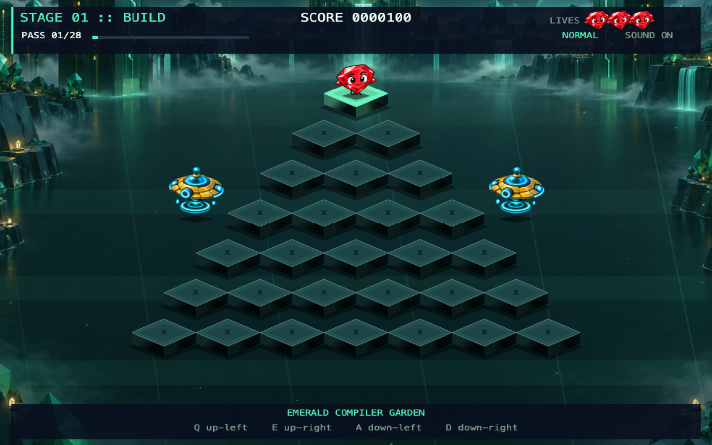
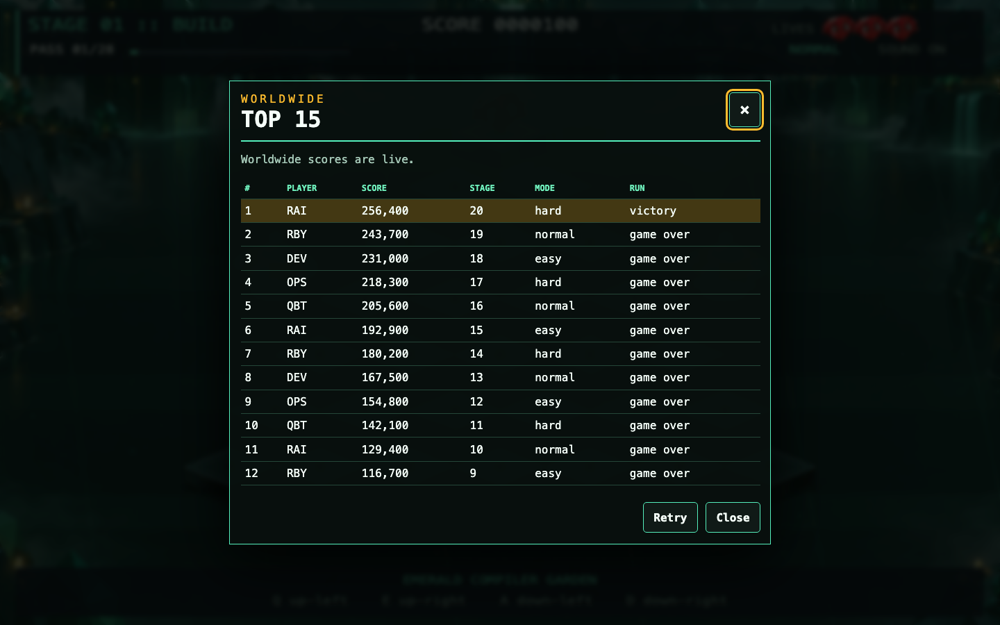
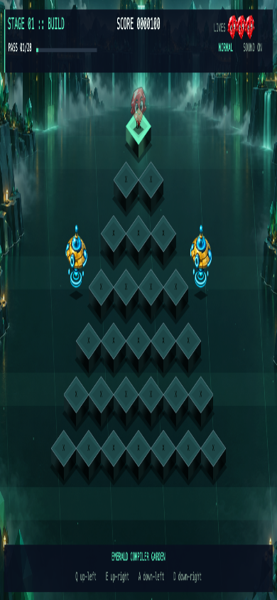
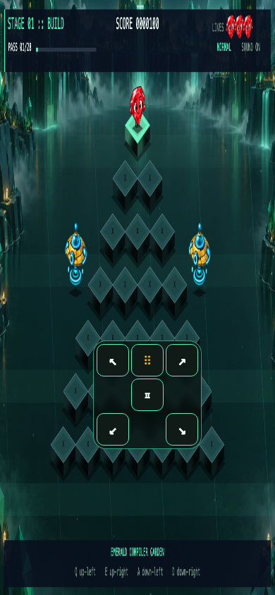

# Rai*bert

Hop the pyramid. Fix the build. Ship the pipeline.

**[▶ Play Rai*bert](https://raibert.lol/)**

[](https://github.com/cdimartino/raibert/actions/workflows/ci.yml)
[](https://github.com/cdimartino/raibert/actions/workflows/deploy.yml)
[](https://www.ruby-lang.org/)
[](LICENSE)



Rai*bert is a fast Q*bert-inspired arcade game built in Ruby. Turn every failing build tile green while dodging bugs, exceptions, and regressions through a 20-stage software-delivery odyssey.

## Features

- A complete 20-stage campaign across Easy, Normal, and Hard.
- Two playable Rais, three enemy behaviors, five powerups, rescue platforms, and unique level themes.
- True full-screen play on desktop and mobile with keyboard or gesture input.
- An optional movable touch D-pad that remembers where you put it.
- A shared worldwide Top 15 with arcade-style three-letter initials.
- The same deterministic Ruby rules on native Gosu and Ruby/Wasm in the browser.

## How to play

Land on every tile until the board is green. Avoid enemies, collect falling powerups, and use each side rescue once. Later stages need multiple landings per tile. There are no checkpoints: a failed build starts a new run.

### Desktop

| Action | Keys |
| --- | --- |
| Hop diagonally | `Q` `E` `A` `D` |
| Select character / difficulty | Arrow keys |
| Start | Enter |
| Pause / back | Escape |
| Options / mute / leaderboard | `O` / `M` / `L` |

### Mobile

Swipe diagonally to hop. On the selection screen, swipe horizontally for a character, vertically for difficulty, and tap to start. Tap during play to pause; hold on selection to open the menu. A compact draggable D-pad is available from the menu and is hidden by default.

## Worldwide leaderboard

Every completed browser run can compete on one worldwide Top 15. The board ranks score first, then earliest server acceptance. Enter exactly three letters after a qualifying game over or victory. The board is intentionally casual and client-authoritative: validation, throttling, moderation, and idempotency reduce abuse, but cannot cryptographically prove a browser-generated score.



<p align="center"> </p>

## Run locally

Ruby 4.0.7 is pinned with mise. Native play additionally needs SDL2 and Gosu.

```sh
brew install mise sdl2
mise install
mise exec -- bundle install
mise exec -- bundle exec ruby game.rb
```

For the browser build:

```sh
mise exec -- bundle config set --local without desktop
mise exec -- bundle install
mise exec -- bundle exec puma
```

Open `http://localhost:9292`. See [Web runtime internals](docs/web-runtime.md) before rebuilding the committed Wasm bundle.

## Architecture

The hosted game is a static Canvas/Web Audio client running Ruby 4.0 in WebAssembly. CloudFront serves the private S3 origin and signs requests to a private Ruby Lambda Function URL. Lambda validates and transactionally updates a capped DynamoDB board. AWS WAF, reserved concurrency, structured logs, and alarms provide operational limits without putting an administrative API on the public internet.

See [Deployment](docs/deployment.md) for AWS operations and [Contributing](CONTRIBUTING.md) for the development workflow.

## Test

```sh
mise exec -- bundle check
mise exec -- npm ci --prefix web
mise exec -- npx --prefix web playwright install chromium
mise exec -- script/test
```

CI enforces 100% executable-line coverage for `GameState` and the leaderboard domain, runs deterministic campaigns, browser-shim and infrastructure checks, and executes Playwright on desktop and mobile viewports. Production deployment runs only after `main` passes CI.

## Credits and license

Rai character artwork is derived from `rai-pets-v2.zip`. Game art prompts are preserved in `assets/art/PROMPTS.md`. Rai*bert uses [Gosu](https://www.libgosu.org/), CRuby, and ruby.wasm and is released under the [MIT License](LICENSE).
