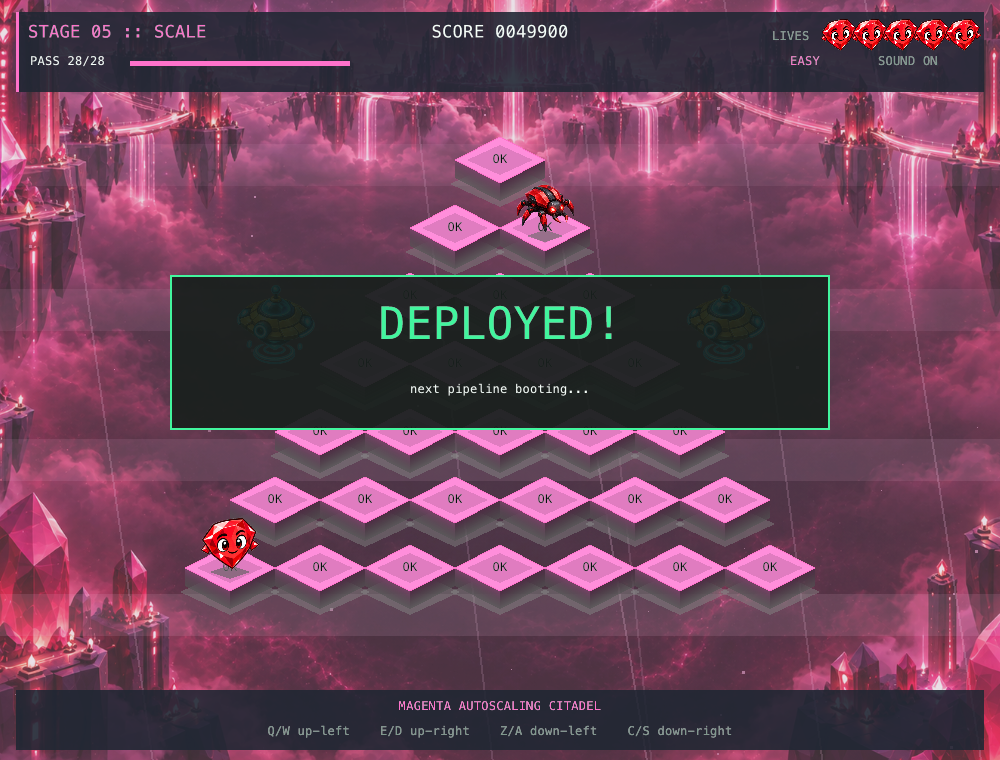
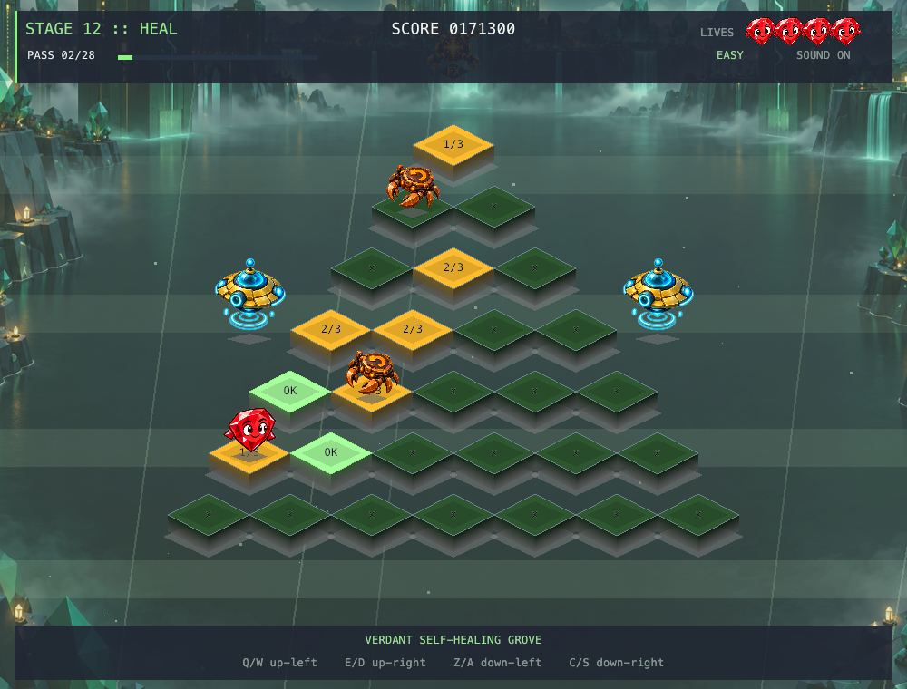

# Rai*bert

Ship the pipeline, one hop at a time.

Rai*bert is a Q*bert-inspired Ruby arcade game. Turn every failing build tile into a passing build while dodging bugs, exceptions, and regressions across a 20-level campaign.





## Features

- 20 stages, from Build to Ship, with rising tile, enemy, and timing pressure.
- Easy, Normal, and Hard modes with different lives, enemy density, enemy speed, spawn rate, and powerup timing.
- Three enemy behaviors: descending bugs, chasing exceptions, and regressions that undo tile progress.
- Five falling, limited-time powerups: enemy freeze, enemy clear, extra life, shield, and tile repair.
- Two selectable Rai characters with directional hops, themed idle loops, and death/respawn animation.
- Layered stage presentation with illustrated worlds, atmospheric bands, data lanes, particles, palettes, and quiet ambient music with a different phrase for each level.
- Soft, distinct cues for takeoff, touchdown, tile completion, each powerup, rescue, and success or failure; music sits behind the game sounds.
- One-use rescue platforms on both edges of each stage.
- No checkpoints: by default, Game Over restarts at Level 1, while clearing Level 20 reaches the victory screen.

## Gameplay

Land on every tile enough times to complete the stage. Level 1 needs one landing per tile, Levels 2–4 need two, and Levels 5–20 need three. Tile progress changes only after Rai lands.

Enemy pressure increases throughout the campaign. Bugs descend the pyramid, exceptions chase Rai, and regressions remove progress from tiles they touch. Clearing a stage restores one lost life up to the configured starting amount.

### Powerups

| Drop | Effect |
| --- | --- |
| `DBG` | Freezes enemies for four seconds. |
| `GC` | Clears every active enemy. |
| `1UP` | Adds one life, up to one above the configured starting amount. |
| `SH` | Grants five seconds of collision protection. |
| `FX` | Repairs three unfinished tiles by one step. |

Drops enter at the summit, fall one row at a time, and disappear after leaving the board. They fall faster on later levels and harder difficulties, so collecting one means changing route before time runs out.

## Requirements

The included setup targets macOS and uses:

- [Homebrew](https://brew.sh/)
- [mise](https://mise.jdx.dev/)
- Ruby 4.0.7
- SDL2
- Xcode Command Line Tools or another working macOS C toolchain

Gosu and the remaining Ruby dependencies are declared in `Gemfile` and locked in `Gemfile.lock`.

The browser build is a stateless Rack application. Its compiled Ruby 4.0.7 WebAssembly runtime is committed, so hosting it does not require Node.js or Docker. Installing Puma and nio4r may still require the platform's standard Ruby C build tools.

## Install and run on macOS

```sh
brew install mise sdl2
mise install
mise exec -- bundle install
mise exec -- bundle exec ruby game.rb
```

If macOS asks for the Xcode license while compiling a native dependency, review and accept it in Terminal before retrying `bundle install`.

After the first setup, launch with:

```sh
mise exec -- bundle exec ruby game.rb
```

## Run in a browser

Install the locked server gems and start Puma:

```sh
mise exec -- bundle config set --local without desktop
mise exec -- bundle install
mise exec -- bundle exec puma
```

Skip the `bundle config` line on a machine that also runs the native desktop game.

Open `http://localhost:9292`. Set `PORT` when the hosting platform assigns one:

```sh
PORT=8080 mise exec -- bundle exec puma
```

On a host that already provides Ruby 4.0.7 and Bundler, omit the `mise exec --` prefix. Deploy the repository root, including `public/web` and `assets`, run `bundle exec puma`, and terminate HTTPS at the platform or reverse proxy. The shell uses absolute `/web` and `/assets` URLs, so mount it at the origin root rather than under a path prefix.

The browser runs the same Ruby game and rules locally through WebAssembly. Rack only serves the application and existing assets; it stores no sessions or game state. Reloading starts a new run.

The bounded native Gosu/Emscripten gate was rejected because CRuby 4.0.7's Emscripten coroutine backend requires Asyncify. The shipped build therefore uses the supported WASI runtime with the small Canvas/Web Audio Gosu compatibility layer in `web/gosu.rb`.

Keyboard controls match the desktop game. The page also provides touch buttons for the four contextual directions, start/confirm, options, pause/back, and mute. Browser audio starts after the first keyboard or touch action, as required by browser autoplay policies.

The first visit downloads the Ruby/WebAssembly runtime, artwork, and initial audio, so it is substantially larger than a typical static page; content-hashed runtime files are cached after that load. Browser mode requires WebAssembly, ES modules, Canvas 2D, and Web Audio. Desktop CLI overrides and `--demo` are not available in the browser.

### Rebuild the web runtime

The committed runtime is ready to host. Rebuild after changing `game.rb`, `lib/`, `config/controls.json`, the browser shim/boot code, or the ruby.wasm loader:

```sh
script/build_web
```

The build requires a running Docker daemon. It compiles the pinned CRuby 4.0.7 WASI runtime, packages only the Ruby source and configuration into WebAssembly, bundles the pinned ruby.wasm browser loader, and writes content-hashed artifacts plus license notices under `public/web`. Images and audio remain under `/assets` and are not duplicated in the Wasm binary.

Docker must support `linux/amd64` containers. The script reuses the ignored `build/web-runtime` cache and invalidates its compiled Ruby base when build inputs change. Changes limited to `public/index.html`, `public/web/app.css`, or `public/web/app.js` are served directly and do not require a Wasm rebuild.

### Regenerate the audio

Run `python3 script/build_audio.py` to regenerate the original 20 ambient loops and 15 effects using Python's standard library. The score uses slow D-major harmony, warm pads, and sparse mallet notes at 60 BPM, with no percussion. WAVs are checked in and shared by desktop and browser; audio generation is not needed to play. The mix lives in `game.rb` (music `0.18`, effects `0.55`); individual cue envelopes and levels live in the generator.

## Command-line options

These options apply to the native desktop launch only; the browser always opens the character and difficulty selection screen at Level 1.

Launching without flags is unchanged: choose a character and difficulty in the game, then begin at Level 1 with that difficulty's normal life count.

Use these optional overrides for testing and demos:

```sh
# Start at Level 12
mise exec -- bundle exec ruby game.rb --level 12

# Start with six lives
mise exec -- bundle exec ruby game.rb --lives 6

# Combine overrides
mise exec -- bundle exec ruby game.rb --level 12 --lives 6 --difficulty hard

# Autoplay the same configured run
mise exec -- bundle exec ruby game.rb --demo --level 12 --lives 6 --difficulty hard
```

`--level` accepts `1`–`20`, `--lives` accepts `1`–`99`, and `--difficulty` accepts `easy`, `normal`, or `hard`. Invalid values are rejected instead of being silently adjusted. Run `mise exec -- bundle exec ruby game.rb --help` for the full usage summary.

The overrides are launch settings, not checkpoints: after Game Over, the game restarts at the configured start level with the configured starting lives. Demo mode makes normal directional moves through the real tick, enemy, collision, tile, and powerup rules; it does not mutate progress directly and stops on the visible victory screen.

## Controls

| Action | Default keys |
| --- | --- |
| Hop up-left | `Q` or `W` |
| Hop up-right | `E` or `D` |
| Hop down-left | `Z` or `A` |
| Hop down-right | `C` or `S` |
| Choose character | Left / Right |
| Choose difficulty | Up / Down |
| Start or restart | Enter |
| Pause or return to character select | Escape |
| Mute music and effects | `M` |

## Configuration

Bindings live in `config/controls.json`. Movement defaults to Q/E/A/D with one key per direction. Press O before starting or while paused to replace a movement key for the current session. The game rejects unsupported, reserved, and duplicate bindings.

```json
{
  "up_left": ["q", "w"],
  "up_right": ["e", "d"],
  "down_left": ["z", "a"],
  "down_right": ["c", "s"]
}
```

The desktop app reads this file at launch. The browser copy is embedded in the Wasm artifact, so rerun `script/build_web` after changing bindings; semantic touch buttons continue to follow the configured actions.

Difficulty and character are normally selected in the game; `--difficulty` can preset the difficulty for a test or demo run. No save file or checkpoint configuration is used.

## Test

After installing dependencies, run the rules smoke test:

The full smoke test requires the `desktop` bundle group. A browser-only install made with `without desktop` can run `test/web_shim_test.rb` and `test/rack_test.rb`; unset that Bundler setting and install Gosu before running `test/smoke_test.rb`.

```sh
mise exec -- bundle check
mise exec -- bundle exec ruby test/smoke_test.rb
mise exec -- ruby test/web_shim_test.rb
mise exec -- bundle exec ruby test/rack_test.rb
node test/audio_test.mjs
```

The smoke test covers campaign progression, CLI validation, difficulty scaling, enemies, touchdown timing, rescues, powerup effects and expiry, life limits, Game Over reset, and Level 20 victory.

## Project layout

```text
game.rb                 Gosu window, input, rendering, animation, and audio
lib/game_state.rb       Deterministic game rules and balance
lib/demo_window.rb      Real-input autoplay driver used by --demo
config/controls.json    Customizable key bindings
config.ru               Rack entry point for the browser build
web/                    Browser Gosu compatibility layer and Wasm boot code
public/                  Browser shell and compiled WebAssembly runtime
script/build_web         Reproducible Docker-based web runtime build
assets/art/             Stage, enemy, rescue, and powerup artwork
assets/music/           One soundtrack per level
assets/sounds/          Distinct soft gameplay cues
script/build_audio.py   Reproducible ambient score and sound effects
assets/rai*/            Character sprite sheets
test/smoke_test.rb      Runnable gameplay rules check
```

## Credits and licensing

Rai character artwork is derived from the supplied `rai-pets-v2.zip`. Stage, enemy, rescue, and powerup art was generated for this game; generation prompts are preserved in `assets/art/PROMPTS.md`. [Gosu](https://www.libgosu.org/) is MIT-licensed.

The browser runtime includes CRuby and ruby.wasm. Their license and notice files are distributed with the generated files under `public/web/licenses`.

Rai*bert is released under the [MIT License](LICENSE).
