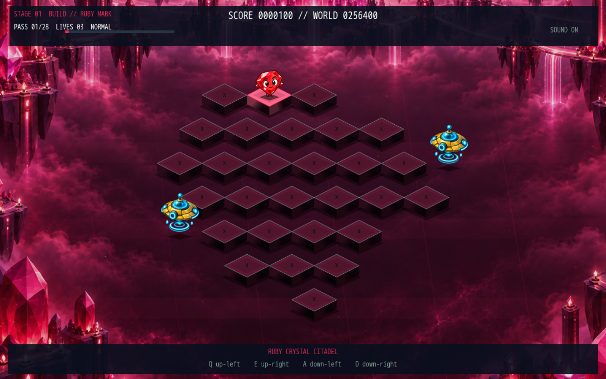
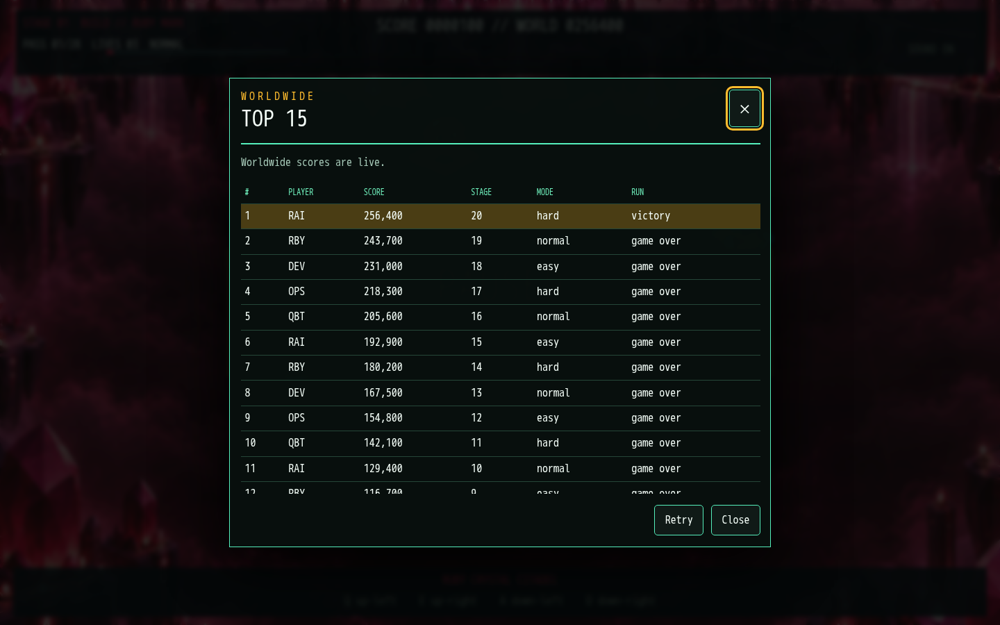
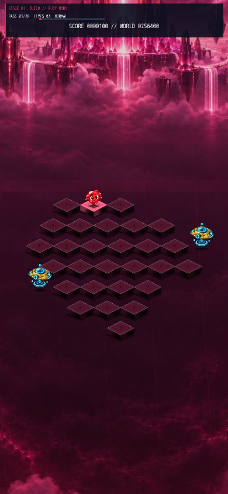
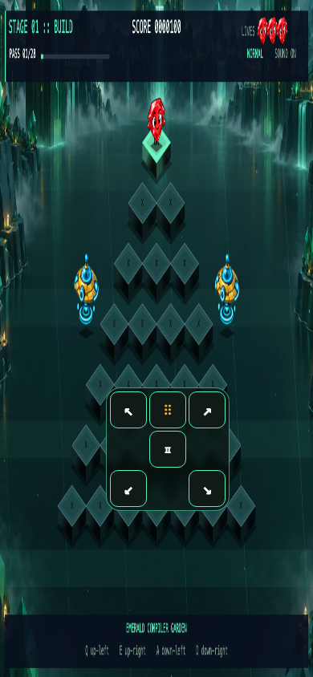

# Rai*bert

Hop shifting gemstone boards. Fix the build. Ship the pipeline.

**[▶ Play Rai*bert](https://raibert.lol/)**

[](https://github.com/cdimartino/raibert/actions/workflows/ci.yml)
[](https://github.com/cdimartino/raibert/actions/workflows/deploy.yml)
[](https://www.ruby-lang.org/)
[](LICENSE)



Rai*bert is a fast Q*bert-inspired arcade game built in Ruby. Turn every failing build tile green while dodging bugs, exceptions, and regressions through a 20-stage software-delivery odyssey.

## Features

- A complete 20-stage campaign across Easy, Normal, and Hard, progressing from ruby cuts to original impossible stair boards.
- Two playable Rais, three enemy behaviors, five powerups, rescue platforms, and unique level themes.
- Responsive boards, selection screens, menus, and larger text on desktop and mobile, with keyboard or gesture input.
- An optional movable touch D-pad that remembers where you put it.
- A shared worldwide Top 15 with arcade-style three-letter initials.
- The same deterministic Ruby rules on native Gosu and Ruby/Wasm in the browser.

## How to play

Land on every tile until the board is green. Each stage introduces a different board shape; later boards add holes, loops, and glowing impossible stair connections. Avoid enemies, collect falling powerups, and use each side rescue once. Later stages need multiple landings per tile. Enemies and powerups reserve separate tiles when spawning and moving; blocked objects wait or use another available route. There are no checkpoints: a failed build starts a new run.

### Desktop

| Action | Keys |
| --- | --- |
| Hop diagonally | `Q` `E` `A` `D` |
| Select character / difficulty | Arrow keys |
| Start | Enter |
| Pause / back | Escape |
| Options / mute / leaderboard | `O` / `M` / `L` |

Open controls with `O` on the selection screen or while paused. Remap each direction, choose the optional diamond preset (`Q`/`R` above `S`/`D`), or reset to defaults. Movement can reuse selection keys, while gameplay shortcuts remain reserved. Browser bindings persist across reloads.

Gold marks and arrows show each rescue ship’s exact launch tile and direction. Follow that arrow; jumping toward the same ship from another tile can still cause a fall. Each ship works once per stage and returns you to the board’s start.

### Mobile

Swipe diagonally to hop. On the selection screen, swipe horizontally for a character, vertically for difficulty, and tap to start. Hold still for 0.6 seconds during play to pause or on selection to open the menu. Quick taps during play are ignored. A compact draggable D-pad is available from the menu and is hidden by default.

After a loss or victory, an animated ending with a custom sound leads into the leaderboard. The result panel retains your final score, stage, and earned bonuses. The footer shows **Submit score** / **Skip score**, then replaces those actions with **Retry game** after submission or an explicit skip. **Refresh** only reloads the leaderboard.

## Powerups and scoring strategy

Every pickup awards 300 points. Seek reachable pickups before ordinary tile work, but avoid unsafe landings and abandon a pursuit that stalls. The automatic player uses the same priorities.

| Pickup | Effect | Best use |
| --- | --- | --- |
| DBG | Freezes enemy movement for 4 seconds | Cross threatened areas and finish tiles while enemies are frozen. |
| GC | Clears current enemies | Escape a crowded board; new enemies can still spawn afterward. |
| 1UP | Adds a life, capped at starting lives plus one | Extend a run, especially when lives are low. |
| SH | Protects against collisions for 5 seconds | Collect safely and cross threatened tiles during protection. |
| FX | Advances up to three unfinished tiles by one step | Reduce repeated hops and preserve the stage speed bonus. |

The header always shows the selected difficulty's high score. Beating it turns the header gold, adds **NEW HIGH!**, and plays a rising chime once per run unless muted. A difficulty record can be submitted even below the worldwide Top 15; submitting remains an explicit action. Existing records are initialized from retained leaderboard entries, since older scores outside that list were not stored.

## Worldwide leaderboard

Every completed browser run can compete on one worldwide Top 15. The board ranks score first, then earliest server acceptance. Enter exactly three letters after a qualifying game over or victory. The board is intentionally casual and client-authoritative: validation, throttling, moderation, and idempotency reduce abuse, but cannot cryptographically prove a browser-generated score.



<p align="center"> </p>

## Run locally

Ruby 4.0.7 is pinned with mise. Native play additionally needs SDL2 and Gosu.

```sh
brew install mise sdl2
mise install
mise exec -- bundle install
mise exec -- bundle exec ruby game.rb
```

For the browser build:

```sh
mise exec -- bundle config set --local without desktop
mise exec -- bundle install
mise exec -- bundle exec puma
```

Open `http://localhost:9292`. See [Web runtime internals](docs/web-runtime.md) before rebuilding the committed Wasm bundle.

## Architecture

The hosted game is a static Canvas/Web Audio client running Ruby 4.0 in WebAssembly. CloudFront serves the private S3 origin and signs requests to a private Ruby Lambda Function URL. Lambda validates and transactionally updates a capped DynamoDB board. AWS WAF, configurable reserved concurrency, structured logs, and alarms provide operational limits without putting an administrative API on the public internet.

See [Deployment](docs/deployment.md) for AWS operations and [Contributing](CONTRIBUTING.md) for the development workflow.

## Test

```sh
mise exec -- bundle check
mise exec -- npm ci --prefix web
mise exec -- npx --prefix web playwright install chromium
mise exec -- script/test
```

CI enforces 100% executable-line coverage for `GameState`, the board-layout model/catalog, and the leaderboard domain, runs deterministic campaigns, browser-shim and infrastructure checks, and executes Playwright on desktop and mobile viewports. Production deployment runs only after `main` passes CI.

## Credits and license

Rai character artwork is derived from `rai-pets-v2.zip`. Game art prompts are preserved in `assets/art/PROMPTS.md`. The Level 1 silhouette is adapted from the [Ruby logo](https://www.ruby-lang.org/en/about/logo/), copyright Yukihiro Matsumoto, licensed under [CC BY-SA 2.5](https://creativecommons.org/licenses/by-sa/2.5/); the distributed notice contains the full attribution. Higher-level impossible boards are original compositions. Rai*bert uses [Gosu](https://www.libgosu.org/), CRuby, and ruby.wasm and is released under the [MIT License](LICENSE).

## Site activity

The private AWS CloudWatch `raibert-prod-usage` dashboard reports visits, browser sessions, gameplay starts and outcomes, active play time, and runtime errors. See [analytics access and deployment](docs/deployment.md#visitor-and-gameplay-analytics) for setup and counting details.

Stage clears award a speed bonus of up to 2,000 × stage, counting down over 1.2 seconds per required tile increment, plus 500 × stage for a clear without losing a life. Pauses stop the game clock. The HUD previews both bonuses; the ending sequence and scoreboard show earned run totals. From stage 3, purple regression enemies marked **UNDO −1** remove tile progress that you must restore.
